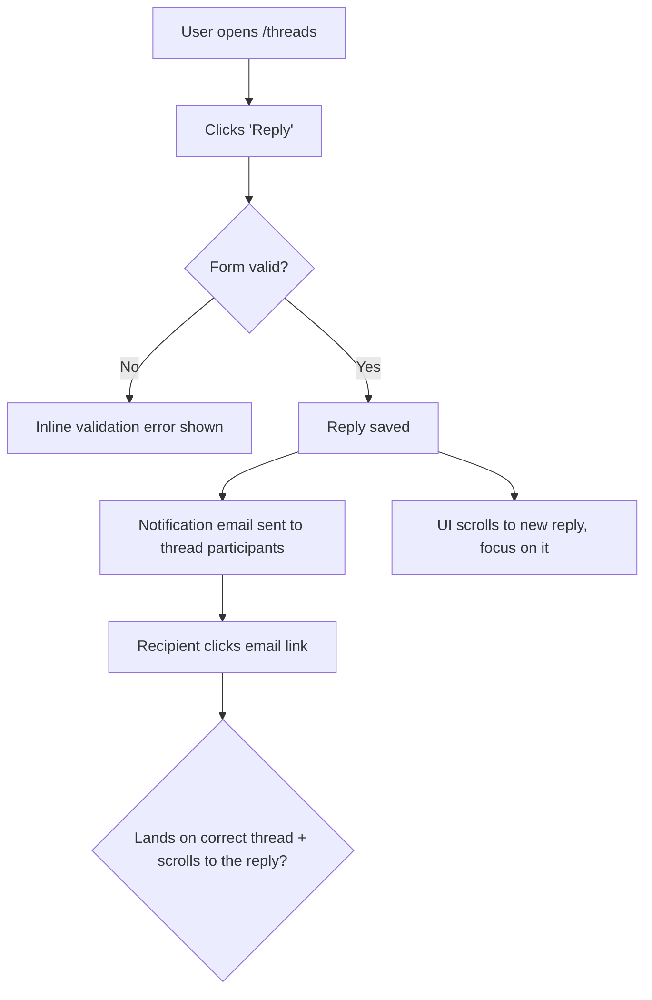

# Dogfood

*Imported/adapted from Every's Compound Engineering plugin (github.com/EveryInc/compound-engineering, MIT).*

Act as a QA engineer who dogfoods the **active branch** end to end: understand every change, exercise every change in a real browser as a user would, and fix what is broken — until the branch is genuinely ready. This is **diff-scoped**, not whole-app exploration: you test what *this branch* introduced or changed versus the trunk.

Dogfood is the QA **orchestration** layer. It owns the diff-scoped reasoning — the flow map, the test matrix, the fix-and-regression loop, the persona paper-cut pass, and the durable report. It does **not** own browser mechanics: delegate the actual driving of the browser (navigate, click, fill, screenshot, console and network checks) to `browser-verify`, and reason over what it reports back.

## Posture: propose-first

Atlas is propose-first. Three gates apply before anything with side effects:

- **Confirm before isolating.** Creating a worktree changes the workspace — ask first (Phase 0).
- **Commit only in an apply/opt-in posture.** The fix loop *proposes* fixes by default. It commits (and captures learnings) only when the user has opted into an apply posture; absent that, apply the fix in the working tree, prove it, and leave committing to the user.
- **Confirm before a large fix.** A small, obvious, low-risk fix is yours to make. A large or ambiguous one — architecture, schema, product/UX trade-off, competing solutions — is escalated to the user as a recorded decision, never forced autonomously.

## Delegation

Dogfood is an orchestrator — delegate rather than re-derive:

| When | Skill |
|------|-------|
| Isolate the run from the main checkout | `git:worktree` |
| Drive the browser for a scenario (navigate, interact, screenshot, console/network) | `browser-verify` |
| A failure's root cause is non-obvious | `debug` |
| A bug reveals a reusable lesson | `compound` |

## Workflow

```
0. Scope      Pick the branch, get onto it (confirm before isolating), never touch the trunk
1. Analyze    Diff branch vs trunk; understand every change; ground in personas
2. Map+Matrix Draw the flows as Mermaid, derive the test matrix as a task list, create the report checkpoint
3. Serve      Start the dev server on the detected port
4. Execute    Work the matrix one item at a time via browser-verify; judge correctness AND experience
5. Fix loop   On a defect: fix -> regression test -> (commit if apply posture) -> re-verify
6. Report     Finalize the durable dogfood report with a readiness verdict
```

### Phase 0: Scope and get on the right branch

Identify the target — a PR number, a branch name, or blank (the current branch):

- **PR number:** the target *is the PR* — carry the number through every later step. A PR always has a base, so it is always diffable; never refuse it because its head branch happens to be named `main`/`master`.
- **Branch name / blank:** the target is that branch (or the current one).

**Refuse to run on the trunk** for a branch-name or blank target: if it resolves to the trunk (`main`/`master`/the detected default), stop — there is no diff to dogfood.

**Decide isolation by what you are testing; let `git:worktree` own the mechanics.**

- **Blank / current-branch target:** do **not** isolate — dogfood in place. You are already on the branch under test, the fix commits belong on it, and git cannot check the same branch out in a second worktree.
- **A PR or a different named branch:** this is an existing ref to test without disturbing your checkout. **Confirm first** (propose-first gate), then on yes invoke `git:worktree` to isolate that target ref and act on its verdict. On no, check the target out in place (`gh pr checkout <number>` or `git checkout <branch>`), confirming first if uncommitted changes would be disturbed.

**Resume if a prior run exists.** Look for an existing report at `docs/dogfood-reports/*-<branch-slug>-dogfood.md` (see Resumability for the slug rule). If one has unfinished scenarios, ask whether to resume or start fresh. To resume, re-hydrate the task list from its matrix: `Pass`/`Fixed`/`Skipped` stay done; `Pending` becomes remaining work. The two `Blocked` states are **not** auto-runnable — they wait on a person, so surface them and ask how to proceed.

### Resumability (stop and return at any point)

This workflow is designed to be interrupted and resumed. Two pieces of state make that safe:

- **The task list** (the harness's task tool) is the live to-do — one task per matrix scenario. Mark each `in_progress` when you start it and `completed` only when it genuinely passes.
- **The report doc** at `docs/dogfood-reports/<YYYY-MM-DD>-<branch-slug>-dogfood.md` is the durable checkpoint that survives across sessions. `<branch-slug>` is the branch name lowercased with every run of non-alphanumeric characters (slashes included) collapsed to a single `-` (e.g. `feature/Foo_Bar` -> `feature-foo-bar`). **Create it as soon as the matrix exists (end of Phase 2)** by instantiating [references/dogfood-report-template.md](references/dogfood-report-template.md), fill every scenario at `Pending`, and **update it incrementally** — after each scenario is judged and after each fix — not only at the end.

Because tasks are session-scoped but the report doc is on disk, the report is the source of truth for resuming. Keep the two in sync.

### Phase 1: Analyze changes

Resolve the trunk to a ref that actually exists, then diff against it. Do not hard-code `main` — a repo whose default is `master` (or anything else) would fail with `fatal: ambiguous argument 'main...HEAD'`.

```bash
DEFAULT=$(git symbolic-ref --quiet --short refs/remotes/origin/HEAD 2>/dev/null | sed 's@^origin/@@')
DEFAULT=${DEFAULT:-$(gh repo view --json defaultBranchRef -q .defaultBranchRef.name 2>/dev/null)}
TRUNK=""
for cand in "$DEFAULT" main master; do
  [ -n "$cand" ] || continue
  if git show-ref --verify --quiet "refs/heads/$cand"; then TRUNK=$cand; break
  elif git show-ref --verify --quiet "refs/remotes/origin/$cand"; then TRUNK="origin/$cand"; break; fi
done
TRUNK=${TRUNK:-main}

git diff --name-only "$TRUNK...HEAD"   # what changed
git diff "$TRUNK...HEAD"               # how it changed
```

Build a mental model of every change: new features, modified behavior, new routes/views/components, touched data flows. Note anything that produces user-visible behavior — that is what the matrix must cover.

**Ground in the product's personas and vision** so flows are judged from real users' eyes, not just "does it work." Check, in order: `STRATEGY.md` (its "Who it's for" section), `VISION.md`, and any persona docs (`docs/personas/`, `PERSONAS.md`). Capture the 1-3 primary personas and what each cares about. If none exist, infer a reasonable primary persona from the product and the diff, and say so in the report.

### Phase 2: Map the flows, then build the matrix

Do not jump straight to a flat list of pages. First **understand the user flows the diff touches**, then derive the matrix from them. A matrix built without a flow model tests pages in isolation and misses the journey — the email that "sends" but lands in the wrong thread.

#### 2a. Map the user flows (required)

For every user-visible change, trace the **complete journey** end to end and draw it as a **Mermaid `flowchart`** so the journey is explicit and reviewable before any testing — entry point, each user action, branch points (success / validation error / empty / permission-denied), side effects (emails, jobs, notifications), and the true end state.



The flowchart must carry the click-through and its destination, not stop at "email sent." Produce one flowchart per distinct journey, scaled to the diff: a copy-only change gets one small flowchart, a multi-step feature gets several. Cover the happy path **and** the branch points. These diagrams ARE the understanding — they become the spine of the matrix and belong in the final report.

#### 2b. Derive the matrix from the flows

Walk each flowchart and turn every node and branch into one or more test scenarios. Read [references/test-matrix-taxonomy.md](references/test-matrix-taxonomy.md) for the full set of dimensions (journeys, functional checks, experiential checks, edge/error/empty states, accessibility, responsiveness). Cover both **functional** ("does it work?") and **experiential** ("does it feel right?").

Map changed files to concrete routes (views -> their pages, components -> pages rendering them, layouts -> all pages, stylesheets -> visual regression on key pages) and attach those routes to the flows that exercise them.

**Load the matrix as a task list**, one task per scenario, ordered by flow (following the flowcharts), not by file. Then **create the report checkpoint** (Resumability) from the template with every scenario at `Pending`.

### Phase 3: Detect port and start the dev server

Determine the port (priority: an explicit port argument > a port stated in your in-context project instructions > `package.json` dev script > `.env*` `PORT=` > default `3000`). If a server already listens there, reuse it. Otherwise start the project's dev command (`bin/dev`, `rails server`, `npm run dev`, etc.) in the background and poll the port until it accepts connections. Start the server automatically — do not block on a confirmation for this.

### Phase 4: Execute the matrix

Work the task list **one item at a time**. For each scenario, mark the task `in_progress`, then:

1. **Document** what you are testing (the journey and the expected outcome).
2. **Drive it via `browser-verify`.** Hand the scenario — route, the actions to take, the expected end state, and the viewports — to `browser-verify`, which navigates, interacts, screenshots, and reports each flow as pass/fail with the viewports tested, console errors, failed requests, and evidence. Dogfood does not drive the browser itself; it consumes that report.
3. **Judge both correctness and experience** from what `browser-verify` returns: right data, right destination, sensible content, no console errors — and does it feel aligned with the product?
4. **Walk it as each persona.** Re-run the journey from each primary persona's perspective (Phase 1) and ask where they would feel a **paper cut** — small friction that would not fail a functional test but degrades the experience: a confusing label, an extra click, an unexpected jump, a slow-feeling step, missing feedback, copy that does not match how that persona thinks. A scenario can be functionally `Pass` yet still carry paper cuts. Note each paper cut, which persona feels it, and its severity.
5. **Record** pass/fail plus any paper cuts, with specifics. Mark the task `completed` only when it genuinely passes. Paper cuts do not block a `Pass`, but a **sharp** paper cut (severe enough to fix now) is routed into the Phase 5 fix loop just like a failure. Log the rest in the report.

**External-interaction legs** (OAuth, real email delivery, payments, SMS) cannot be fully driven headlessly — pause, ask the user to verify that leg, and mark the scenario `Blocked (needs human verify)` until they confirm. Then continue.

### Phase 5: Fix loop

When a scenario fails — or a passing scenario carries a sharp paper cut worth fixing now — **fix it and prove it**, but first decide whether the fix is yours to make or a human's to decide (propose-first gate).

**Judge the size of the fix before touching code.** Fix directly when the change is small, well-understood, and low-risk: a clear bug with an obvious correct fix, contained to a few files, no schema/architecture/product trade-off. **Escalate instead** when the change is large or ambiguous — an architectural or schema decision, a change to product behavior or UX intent, many files, plausible competing solutions, or genuine uncertainty about the right answer. Forcing a big judgment call autonomously is worse than escalating it.

**For a small, safe fix:**

1. Investigate the root cause. If it is non-obvious, use `debug`.
2. Apply the fix in the code.
3. **Pair it with an automated regression test** that fails before the fix and passes after, so the bug cannot return. This is mandatory for behavioral and code bugs. When an automated test is genuinely impractical — a pure copy, spacing, or visual fix with no behavioral assertion to make — substitute a documented browser-replay or screenshot check and **state in the report why no automated test was meaningful**. Do not invent a hollow test to satisfy the step.
4. **In an apply/opt-in posture, commit the fix** using `task-to-pr`'s commit conventions (one logical fix per commit, clear message). Otherwise leave it applied in the working tree for the user to commit.
5. Re-verify the failing scenario via `browser-verify` to confirm it now passes; then continue the matrix.
6. If the bug carried a reusable lesson, capture it with `compound` (apply posture only).

**For a change too big to make autonomously:** do not implement. Record it in the report's **Decisions for a human** section with what is broken, why it is not a safe autonomous fix, the options you see (with trade-offs), and your recommendation. Mark the scenario `Blocked (human decision)`, then continue with the rest.

Keep iterating until every task is `completed` or in a terminal `Blocked` state — `Blocked (human decision)` or `Blocked (needs human verify)`. Both are terminal for the loop: they wait on a person, so do not re-queue them. Re-test anything a fix might have affected (watch for regressions in adjacent journeys).

**Before declaring the branch ready, run the project's automated test suite once** — the new regression tests plus everything that already exists. Discover the test command from the project's conventions already in your context; do not assume a runner. Record the result in the report: a green matrix with a red suite is not "ready."

### Phase 6: Write the report artifact

The report doc was created at the end of Phase 2 and updated incrementally throughout. When the matrix is green (or every remaining item is explicitly blocked), **finalize** it at `docs/dogfood-reports/<YYYY-MM-DD>-<branch-slug>-dogfood.md` in the repo under test, then surface a short summary in chat with the file path.

**Finalize against [references/dogfood-report-template.md](references/dogfood-report-template.md)** — the same template the Phase 2 checkpoint was instantiated from, which owns the required sections. Confirm every template-owned section is present and complete; do not reconstruct the section list from memory. Carry forward the cross-phase obligations: the Mermaid flowcharts from Phase 2a, a matrix row per scenario with its commit SHA (where committed), each fix's root cause and the regression test added (or why none was meaningful), paper cuts attributed by persona, learnings worth feeding to `compound`, and a final readiness verdict that records the automated-suite result.
